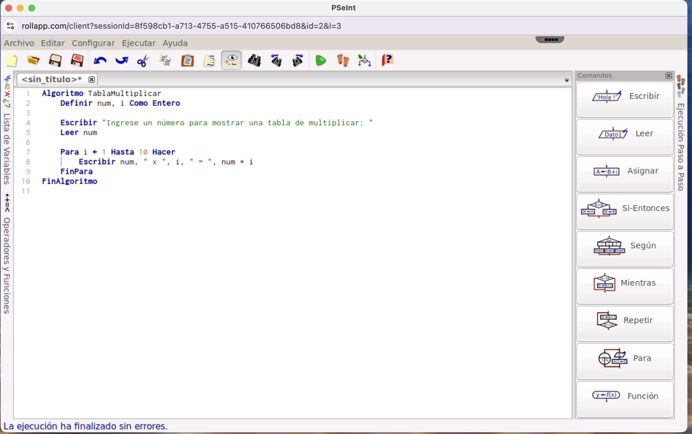
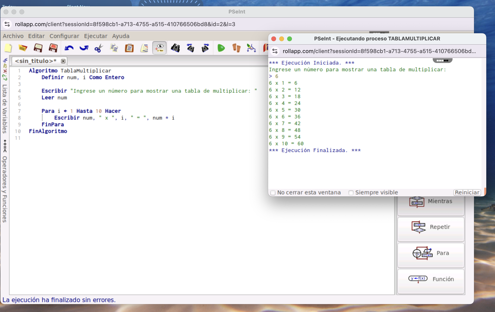
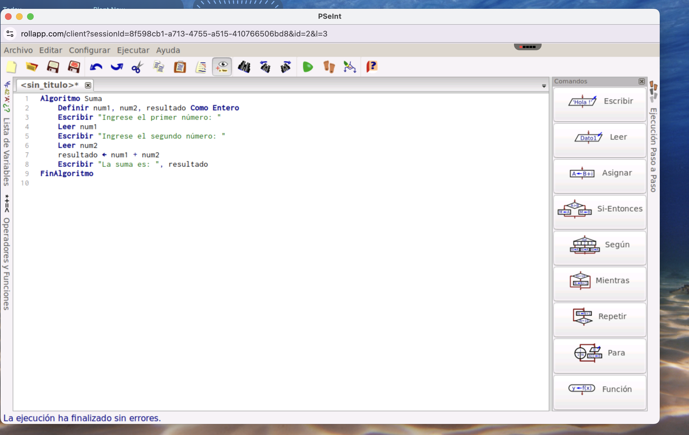
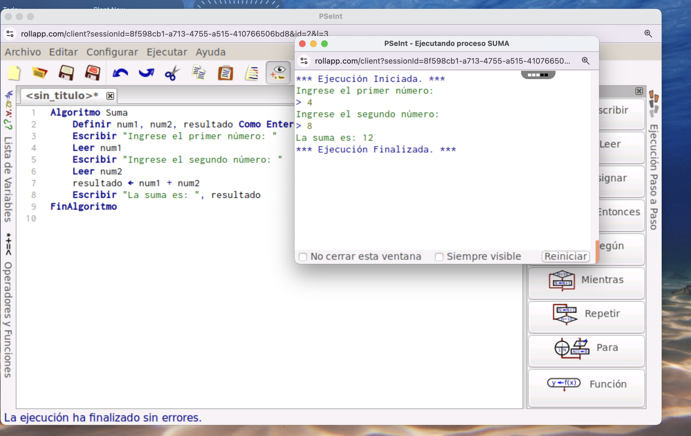

# Instrucciones para ejecutar los algoritmos en PSeInt

Este repositorio contiene dos algoritmos escritos en PSeInt: **TablaMultiplicar** y **Suma**. A continuación, se explica cómo ejecutar cada uno de ellos.

## Requisitos previos

Para ejecutar estos algoritmos, necesitas tener instalado el entorno de PSeInt en tu computador. 

## Algoritmo 1: TablaMultiplicar

### Descripción

Este algoritmo permite al usuario ingresar un número y luego muestra la tabla de multiplicar de ese número, desde el 1 hasta el 10.

### Instrucciones para ejecutar

1. Abre PSeInt.
2. Copia el siguiente código en el editor de PSeInt:

    ```pseudocode
    Algoritmo TablaMultiplicar
        Definir num, i Como Entero
    
        Escribir "Ingrese un número para mostrar su tabla de multiplicar: "
        Leer num
    
        Para i <- 1 Hasta 10 Hacer
            Escribir num, " x ", i, " = ", num * i
        FinPara
    FinAlgoritmo
    ```

3. Haz clic en el botón de **Ejecutar** en PSeInt.
4. Se te pedirá que ingreses un número. Ingresa cualquier número entero.
5. El algoritmo mostrará la tabla de multiplicar de ese número.



---

## Algoritmo 2: Suma

### Descripción

Este algoritmo solicita al usuario dos números y luego calcula su suma, mostrando el resultado.

### Instrucciones para ejecutar

1. Abre PSeInt.
2. Copia el siguiente código en el editor de PSeInt:

    ```pseudocode
    Algoritmo Suma
        Definir num1, num2, resultado Como Entero
        Escribir "Ingrese el primer número: "
        Leer num1
        Escribir "Ingrese el segundo número: "
        Leer num2
        resultado <- num1 + num2
        Escribir "La suma es: ", resultado
    FinAlgoritmo
    ```

3. Haz clic en el botón de **Ejecutar** en PSeInt.
4. Se te pedirá que ingreses dos números. Ingresa cualquier par de números enteros.
5. El algoritmo mostrará la suma de los dos números ingresados.


---

## Contribución

Si deseas contribuir o mejorar estos algoritmos, siéntete libre de abrir un *pull request*.

